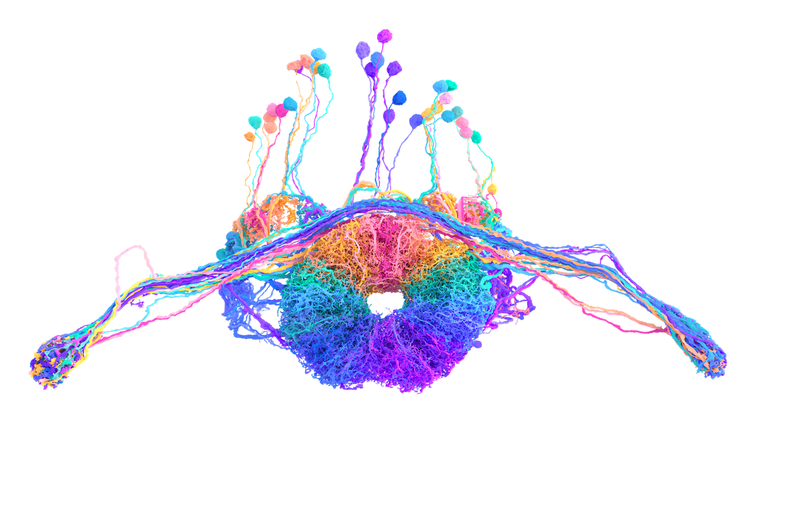
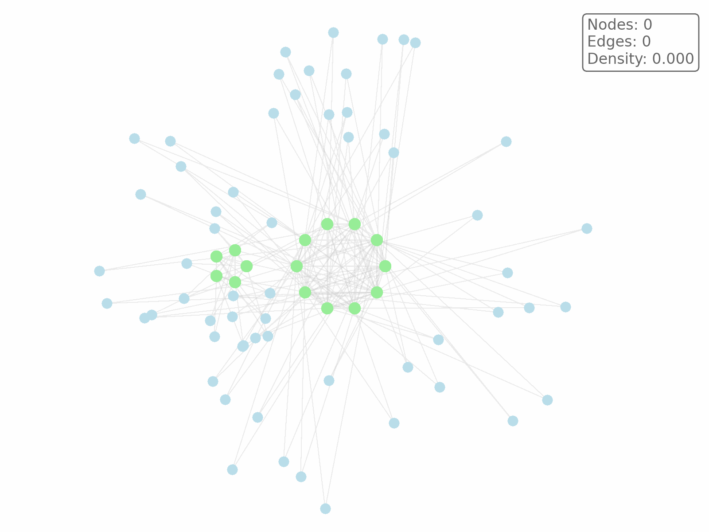
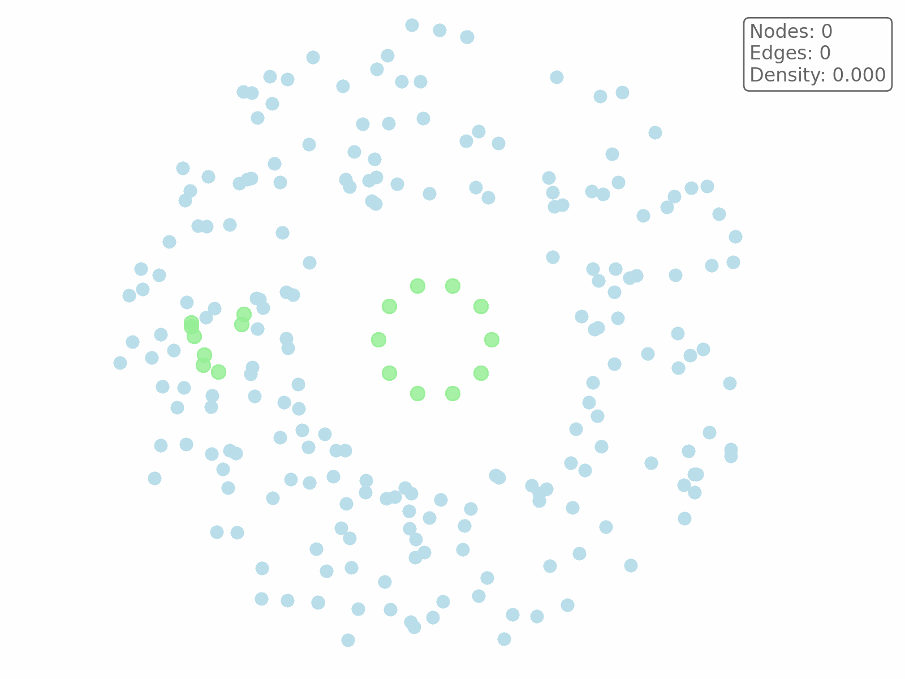

# CORE Algorithm

I developed the **Clique Optimization with Region Exploration (CORE)** algorithm for finding maximum quasi-cliques. This algorithm finished **1st place** in the [Princeton FlyWire Max Quasi-Clique Challenge](https://codex.flywire.ai/app/max_clique_challenge). This challenge involved finding 12 quasi-cliques with different densities, with the lowest densities much sparser than what current algorithms are designed to handle. The CORE algorithm introduces an exploration mechanism called Region Exploration, which explores groups of well-connected nodes together, allowing it to discover regions where individual nodes may appear suboptimal but collectively contribute to better overall solutions.

## The Challenge

This challenge was organized by the FlyWire team at Princeton University. The task was to find dense subgraphs in the FlyWire Brain Connectome, a neuronal wiring diagram represented as an unweighted, undirected graph where vertices represent neurons and edges represent the synaptic connections of an adult female fruit fly.



Participants were tasked with solving the max-quasi clique problem, which is a relaxation of the classic max-clique problem. While the max-clique problem seeks the largest subgraph that is completely connected (density = 1.0), the max-quasi clique problem allows for subgraphs with a lower connectivity density of γ (gamma).

The minimum number of edges required for a quasi-clique is defined as:

$$\gamma \cdot \frac{k \cdot (k - 1)}{2}$$

where `k` is the number of nodes in the subgraph and `γ` is the density threshold.

The specific goal of this challenge was to extract up to 12 large quasi-cliques, one for each density level:

$$\gamma_i = \frac{1}{2^i}, \quad i = 0,1,...,11$$

This creates density thresholds ranging from 1.0 (fully connected clique) down to approximately 0.0005 (very sparse quasi-cliques).

## The Problem with Sparse Quasi-Cliques

Current algorithms are optimized for finding dense cliques. However, when looking for sparse quasi-cliques, these algorithms might fail to find the optimal solution. This is because when searching for sparse quasi-cliques, the optimal solution can consist of multiple cores that are loosely connected together. Current algorithms struggle to discover these structures because they are either too greedy in their selection process or their exploration mechanisms fail to consider groups of nodes that collectively form better solutions.

Consider the graph shown below, which contains a fully connected core and a fully connected subcore, both represented by green nodes. The nodes in the subcore have only one connection to the larger core. Both cores have satellite nodes surrounding them, each connected to exactly three nodes in their respective cores.



A greedy local search algorithm will successfully find one of the cores, but then becomes stuck. It only considers adding satellite nodes because they appear individually better than the green nodes of the other core. However, the green nodes together actually form the optimal solution.

Existing exploration mechanisms fail to solve this problem:

- **Restarts** don't work because when starting in either of the two cores, the algorithm will get stuck trying to greedily explore only satellite nodes which have a better individual connection to the core.
- **Tabu search** doesn't work because when many satellite nodes exist, all of them must be marked as tabu before the seemingly 'suboptimal' green nodes become visible for selection. Setting tabu duration too high will lead to bad performance, because it prevents actual bad nodes from being removed from the solution.
- **Random exploration** with tabu marking also fails. Even when a green node from the subcore is discovered by chance, the algorithm still doesn't consider other green nodes as good candidates since they have weaker connections to the current solution than other available nodes. Further random exploration needs to find a group of green nodes by chance, which becomes highly unlikely when many green nodes need to be explored together.

The key insight is that some nodes need to be explored together with their neighboring nodes to be considered viable additions to the solution.

## Clique Optimization with Region Exploration (CORE)

To solve this problem, the CORE algorithm was developed, which uses an exploration mechanism called region exploration. The algorithm uses greedy local search until no improvements can be found, then switches to region exploration or restarting the solution.

The general CORE procedure begins by generating initial solutions of a given size k and then iteratively improving them through multiple strategies. When the current solution forms a valid quasi-clique, the algorithm expands by adding a node and increasing the target size k. When no expansion is possible, the algorithm primarily uses local search through node swaps to improve solution quality, but when stuck for multiple iterations, it switches to region exploration where it adds a connected region of nodes and then removes the worst nodes to maintain solution size. This process continues until the maximum number of iterations is reached.
```python
def CORE(graph, gamma, max_iterations, max_no_improve, explore_freq):
    k = 1
    S = {}
    best_S = {}
    iterations = 0

    while iterations < max_iterations:
        S = find_initial_solution(graph, k)
        no_improve = 0

        while no_improve < max_no_improve:
            if valid_quasi_clique(S, gamma):
                k++
                S = add_node(graph, S)
            elif no_improve > 0 and no_improve % explore_freq == 0:
                S = region_exploration(graph, S)
            else:
                S = swap_node(graph, S)

            if edges(S) > edges(best_S):
                best_S = S
                no_improve = 0
            else:
                no_improve++

        iterations++

    return best_S
```
The region exploration procedure builds a connected region of nodes by first selecting a random node that is not currently in the solution, then iteratively adding neighboring nodes to form a connected subgraph. Once the region is constructed, all nodes in the region are added to the current solution. To maintain the solution size, the algorithm then removes the worst-performing nodes from the enlarged solution, equal to the number of nodes that were added. This approach allows the algorithm to explore promising connected regions that might not be individually attractive but could collectively improve the solution quality.

```python
def region_exploration(graph, S, region_size):
    region = {}

    for i = 1 to region_size:
        if i == 1:
            node = random_node_excluding(graph, S)
        else:
            node = select_neighbor_node(region, S)
        region = region ∪ {node}

    for node in region:
        S = S ∪ {node}
        
    for i = 1 to region_size:
        worst_node = select_worst_node(S)
        S = S \ {worst_node}

    return S
```

## CORE Animated

In the animation below, the algorithm can be seen working on the graph with two fully connected cores that are loosely connected. The goal is to find the largest quasi-clique with a density of at least 0.5. To make the graph in the animation less messy, the edges are not shown unless they are part of the solution.



The algorithm initially finds the central core but only considers the blue satellite nodes for expansion or local search swaps, since they have a stronger connection to the solution than the green nodes. However, after every five swaps, a new region is explored. This enables the algorithm to discover the green subcore region, which leads to the optimal subgraph with a size of 18 nodes and a density of 0.523.

## Results

The CORE algorithm was tested on the FlyWire Max Quasi-Cliques Challenge graph. To show the effectiveness of the Region Exploration, the CORE algorithm is compared to a version of itself which does not use this exploration mechanism. We refer to this as local search in the results table below.

Both algorithms were implemented in Python/Cython and evaluated using three independent runs per density level with seeds 1, 2, and 3 on a MacBook M1. The density levels ranged from γ = 1.0 down to γ = 1/2048. For CORE, the region exploration was configured with a minimum region size of 10 nodes and a maximum of 200 nodes, triggered every 10 iterations without improvement. Only for the quasi-clique search where γ = 1/1024, we used a max region size of 50, as this greatly improved convergence speed.

The best solution size achieved across the three runs is reported for each density level. When results varied between runs, the average solution size is shown in parentheses. The runtime shows the average time until the best solution was found.

| γ       | **Local** |         | **CORE** |         |
|---------|-----------|---------|----------|---------|
|         | Size      | Time    | Size     | Time    |
| 1       | **40**    | 0.12    | **40**   | **0.04** |
| 1/2     | **175**   | 1.36    | **175**  | **0.13** |
| 1/4     | 369 (353) | 17.13   | **369**  | **0.19** |
| 1/8     | **723**   | **0.16** | **723**  | 0.49    |
| 1/16    | **1541**  | 0.67    | **1541** | **0.35** |
| 1/32    | **3109**  | 42.29   | **3109** | **3.09** |
| 1/64    | **6207**  | **5.43** | **6207** | 19.50   |
| 1/128   | 11755 (11751) | 66.98 | **11757** | **9.14** |
| 1/256   | 20841 (20802) | 99.78 | **20841** | **8.19** |
| 1/512   | 35827     | 2.91    | **35828** | **17.16** |
| 1/1024  | 60425 (60424) | 81.80 | **60430** | **6.93** |
| 1/2048  | **97272** | 10.14   | **97272** | **9.84** |

Local search finds good solutions for many of the cliques within reasonable time. However, for some of the quasi-cliques, local search fails to find the best solution consistently. We can see that the CORE algorithm does perform better in terms of solution quality and convergence speed. For γ=1/4, the CORE algorithm is able to find the best solution almost instantly while the local search finds the optimal solution only in one of the three runs. For γ=1/128, 1/512, 1/1024, the CORE algorithm is consistently able to find a better solution than local search while the running times stay under 20 seconds. This demonstrates that the CORE algorithm is able to effectively find high-quality solutions without needing extensive compute.

## Final Remarks

The code includes support for tabu search, though in practice, I found that disabling tabu often performed just as well or even better. To keep the algorithm simple, the version presented here does not use tabu search. This article doesn't cover all implementation details like tiebreaking rules and neighbor sampling mechanisms, but these can be found in the code repository.

The local search algorithm without Region Exploration is already quite powerful and fast, and when tabu search is enabled, it performs comparably to state-of-the-art methods such as NuQClq and TSQC while being algorithmically simpler.


## Recent Updates

**October 9, 2025**: Added `fixed_k` parameter to the CORE algorithm. When set to a non-zero value, the algorithm optimizes the number of edges for a clique with a fixed number of nodes instead of expanding the solution size.
